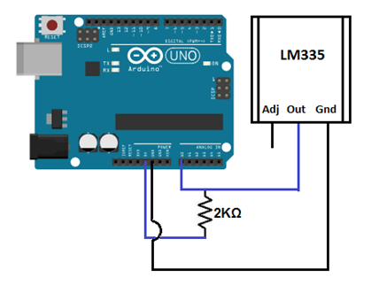
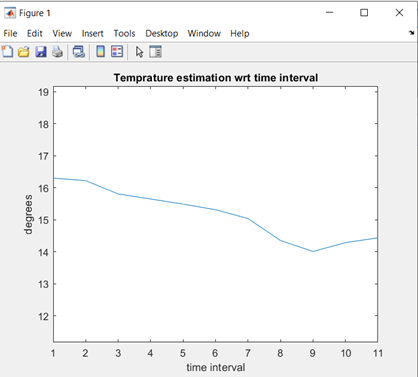
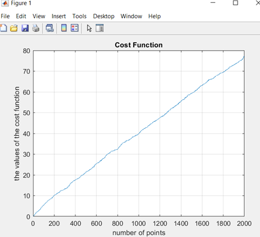

# Random Process Project: Temperature Signal Acquisition and Estimation

**Authors**: Luna Salameh, Zaid Nasser, Ali Ghareeb Khudr  
**Supervisors**: Dr. Ali Kazem, Eng. Diaa Daoud
**Institution**: Higher Institute of Applied Sciences and Technology, Electronic Systems - Communications Department  
**Date**: 2022-03-11  

---

## 📌 Project Goal
The project aims to:
- Acquire random temperature signals using an LM335 temperature sensor with Arduino UNO.
- Analyze the signal's statistical properties, stability, and noise characteristics.
- Estimate the room temperature using multiple estimators (MVUE, Wiener, SLSE).
- Study noise distribution and measurement error.

---

## 🛠 Hardware
- Arduino UNO board
- LM335 temperature sensor
- Resistor
- Jumper wires
- Breadboard

## 💻 Software
- Arduino IDE
- MATLAB

---

## ⚙️ Methodology

### 1️⃣ Circuit Design  
Sensor connected to Arduino UNO as shown:

---

### 2️⃣ Signal Acquisition  
- Voltage readings obtained using Arduino analog pins (10-bit ADC).
- Converted to temperature via:  
  \[
  T_{\text{Kelvin}} = V_{\text{in}} \times 100 \quad T_{\text{Celsius}} = T_{\text{Kelvin}} - 273.15
  \]

---

### 3️⃣ Statistical Modeling  
- The sensor output modeled as:  
  \[
  x[n] = V + w[n]
  \]
  where \( V \) is the true voltage, \( w[n] \) is zero-mean Gaussian noise.

---

### 4️⃣ Estimation Methods  
- **MVUE**: Mean of acquired data.
- **SLSE**: Sequential least squares estimator.
- **Wiener**: (Discussed in theory.)

MATLAB scripts processed the data, estimated temperature, and calculated estimator variance.

---

## 📈 Results

- The estimator variance decreased with longer measurement periods, as expected from theory.
- Example plot of estimator value over time:

- Example plot of SLSE cost function:

- Noise variance estimated at:  
  \[
  \hat{\sigma}^2 = 6.96
  \]

---

## 🔍 Key Findings
- Temperature signal exhibits stationarity over short periods (half hour).
- SLSE and MVUE produced consistent results; variance aligned with Cramer-Rao lower bound.
- Measurement noise follows expected Gaussian distribution.

---

## 🚀 How to Run
1. Flash Arduino with the provided code to acquire data.
2. Import data into MATLAB.
3. Run provided MATLAB scripts to compute estimates and plots.

---

## 📄 License
This project is for academic purposes at HISAT, Syria.
